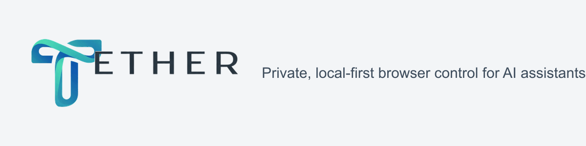
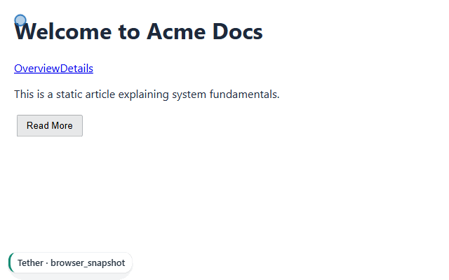
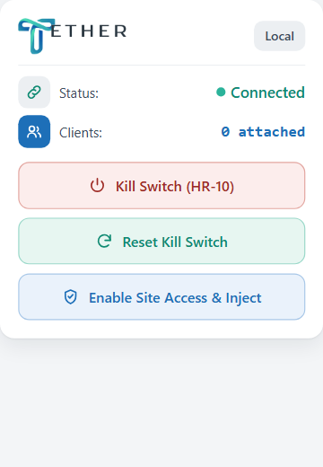
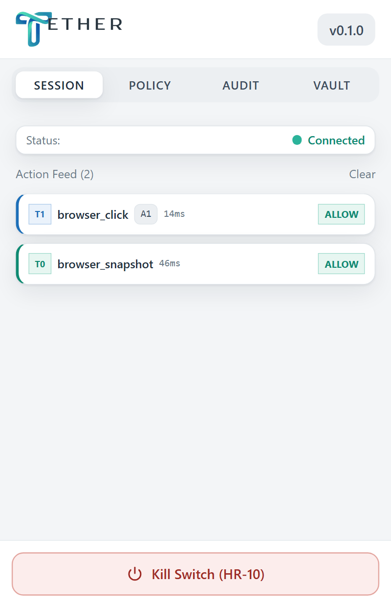
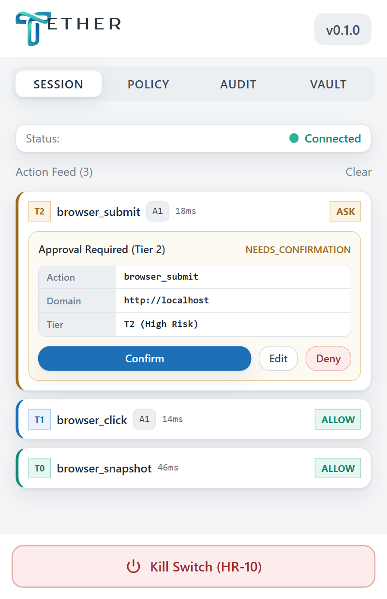
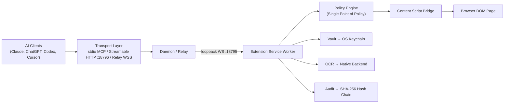

[](https://m8ven.ai/mcp/jyotitiwari250657/tether-mcp-server)

<div align="center">



### Private, local-first browser control for AI assistants — your browser, your rules.

[](https://github.com/jyotitiwari250657/Tether-MCP-server/actions)
[](LICENSE)
[](https://github.com/jyotitiwari250657/Tether-MCP-server/releases)
[](eval/report-live.md)
[](scripts/check-bundle-size.mjs)

</div>

---

## 2. See It Work


*Real-time execution: local daemon, Chrome MV3 extension, and governed MCP tool calls against test fixtures.*

| Popup Control | Live Session Feed | Tier-2 Approval Card |
| :---: | :---: | :---: |
| <br/><sub>**Popup:** Transport status & one-click injection</sub> | <br/><sub>**Governed Click:** Tier pills, refs & ms timing</sub> | <br/><sub>**Per-Action Consent:** Diff rows & Deny action</sub> |

---

## 3. What Tether Is

- **A standard connector, not an autonomous agent:** Your AI client (Claude, ChatGPT, Cursor) brings the reasoning; Tether enforces your rules.
- **Single point of policy:** Every action is decided inside the local extension service worker (`TRD §2.3`). Relays and daemons cannot grant permissions.
- **Zero remote code (HR-1):** Strictly Manifest V3. No `eval`, no remote CDNs, no runtime script fetching.
- **Page content is untrusted data (HR-6):** Extracted text carries `trust: "untrusted"`; prompt injection cannot trigger browser tools.
- **Local OCR redaction:** Screenshot text is scanned locally; PANs, tokens, and credentials are blacked out before returning image bytes.
- **Sub-200ms hard kill switch (HR-10):** Instantly terminates sockets, revokes tokens, and aborts in-flight actions.

### Three Operating Modes (PRD §7.2)

| Mode | Transport | Where Page Data Lives |
|---|---|---|
| **A: Local Daemon** (Default) | Loopback stdio / Streamable HTTP (`:18796`) + WS (`:18795`) | Stays 100% on machine (`127.0.0.1`); zero cloud traffic |
| **B: Encrypted Relay** | Outbound WSS + X25519 & AES-256-GCM sealed envelopes | Client & browser only; relay handles blind ciphertext |
| **C: WebMCP Proxy** | Chrome 149+ declarative web model context proxy | Retained in local browser origin context |

---

## 4. Quick Start (Mode A)

```bash
git clone https://github.com/jyotitiwari250657/Tether-MCP-server.git
cd Tether-MCP-server && pnpm install && pnpm build
node apps/daemon/dist/index.js serve
# Chrome → Extensions → Developer Mode → "Load unpacked" → apps/extension/.output/chrome-mv3
```

Verify streamable HTTP MCP directly using `curl`:

```bash
# 1. Initialize MCP session (returns Mcp-Session-Id header)
curl -s -i -X POST http://127.0.0.1:18796/mcp -H "Content-Type: application/json" -d '{"jsonrpc":"2.0","id":1,"method":"initialize","params":{"protocolVersion":"2025-06-18","capabilities":{},"clientInfo":{"name":"curl","version":"0.1"}}}'
# → HTTP/1.1 200 OK | Mcp-Session-Id: a3f8… | {"jsonrpc":"2.0","id":1,"result":{"protocolVersion":"2025-06-18",…}}

# 2. List tools (returns 40 frozen tools)
curl -s -X POST http://127.0.0.1:18796/mcp -H "Content-Type: application/json" -H "Mcp-Session-Id: a3f8…" -d '{"jsonrpc":"2.0","id":2,"method":"tools/list"}'
# → {"jsonrpc":"2.0","id":2,"result":{"tools":[{"name":"browser_snapshot",…},{"name":"browser_click",…}… 40 tools]}}

# 3. Call tool (snapshot active tab)
curl -s -X POST http://127.0.0.1:18796/mcp -H "Content-Type: application/json" -H "Mcp-Session-Id: a3f8…" -d '{"jsonrpc":"2.0","id":3,"method":"tools/call","params":{"name":"browser_snapshot","arguments":{}}}'
# → {"jsonrpc":"2.0","id":3,"result":{"content":[{"type":"text","text":"# Acme Docs\n[A1] link \"Overview\"\n…"}]}}
```

---

## 5. Architecture



### Components

| Package / App | Role | Key Invariant |
|---|---|---|
| `packages/protocol` | Wire types, envelopes, and 40 tool schemas | Frozen schemas (`HR-4`, `HR-5`); additive-only fields |
| `apps/extension` | MV3 Service worker, UI panels, policy engine, DOM refs | Single point of policy (`TRD §2.3`); 30s max budget (`HR-9`) |
| `apps/daemon` | Loopback WS server, stdio/HTTP MCP, OS keyring bridge | Zero policy granting power; binds loopback `127.0.0.1` |
| `apps/relay` | Cloudflare Worker + Durable Objects for remote clients | Blind ciphertext routing; zero plaintext storage (`HR-7`) |
| `packages/ocr` | Native OS OCR wrappers (Windows/macOS/Linux) | Redacts PII locally before image serialization |
| `packages/eval` | 50-task automated benchmark runner | Tests navigation, form-filling, extraction, policy |
| `apps/web` | Landing site, documentation, and pairing UI | Zero trackers, zero remote CDNs |

### Anatomy of One Tool Call
1. **Client Request:** AI issues JSON-RPC `tools/call` over stdio or Streamable HTTP.
2. **Daemon Auth:** Daemon validates origin and auth token, packaging request into typed envelope.
3. **Loopback Transport:** Dispatched across WebSocket (`:18795`) to the Chrome MV3 service worker.
4. **Policy Decision:** `engine.ts` checks origin grant level; prompts diff card if Tier 2 (`HR-8`).
5. **Ref Resolution:** Element ref (e.g. `A1`) resolves to live DOM node via SHA-1 text signature.
6. **Isolated Action:** Synthetic input sequence (pointer, focus, click) executes safely in content script.
7. **Redaction Pipeline:** Output sanitized against PAN/email regex and native OCR redactor (`HR-7`).
8. **Audit Seal:** Write-ahead SHA-256 tamper-evident entry committed before returning result.

*For deep dive, see [docs/ARCHITECTURE.md](docs/ARCHITECTURE.md).*

---

## 6. Tool Surface

Tether exposes **40 frozen tools** across three functional profiles:

| Read-Only Profile (`~2.4k` token budget) | Description | Risk |
|---|---|---|
| `browser_snapshot`, `browser_find` | Ref-indexed DOM accessibility trees and element lookup | T0 (Read) |
| `browser_get_text`, `browser_extract` | Structured extraction with `trust: "untrusted"` tag | T0 (Read) |
| `browser_screenshot` | Local OCR-sanitized viewport capture | T0 (Read) |
| `browser_tabs`, `browser_history_search` | Tab querying and local title searches | T0 (Read) |

| Action & Governance Profiles (`~4.3k` token budget) | Description | Risk |
|---|---|---|
| `browser_click`, `browser_hover`, `browser_type` | Governed synthetic interactions using resolved refs | T1 (Act) |
| `browser_fill_form`, `browser_select` | Batch field filling and dropdown selections | T1 (Act) |
| `browser_submit`, `browser_dialog` | High-risk destructive submissions; diff approval required | T2 (Confirm) |
| `browser_type_secret` | Vault secret injection directly to input; never context | T2 (Secret) |
| `policy_get`, `policy_grant`, `policy_revoke` | Runtime capability management for domain boundaries | T3 (Admin) |
| `audit_export`, `session_kill` | Export tamper-evident log; absolute kill switch (`HR-10`) | T3 (Admin) |

---

## 7. Security & Governance

- **Single Point of Policy (`TRD §2.3`):** Policy is enforced strictly in `apps/extension/lib/policy/engine.ts`.
- **Zero Plaintext on Wire:** Mode B uses X25519 key exchange + AES-256-GCM authenticated envelopes.
- **Zero Plaintext at Rest:** Credentials resolve from OS Keychain (DPAPI / macOS Keychain / Secret Service).
- **Default Deny (`HR-12`):** Sensitive categories (banking, healthcare, auth) blocked until explicit opt-in.
- **Absolute Kill Switch (`HR-10`):** Aborts in-flight actions and revokes tokens in `<200ms` from popup or API.
- **Tamper-Evident Audit & Local OCR:** Chained SHA-256 log plus on-device OCR redaction of rendered PANs.

*Read the [THREAT_MODEL.md](THREAT_MODEL.md) and [SECURITY.md](SECURITY.md).*

---

## 8. Proof & Quality Gates

Every metric below is verified directly from committed artifacts and live suites:

| Metric / Gate | Proven Value | Artifact Source |
|---|---|---|
| **Unit Test Suite** | 438 passed (69 test files) | `pnpm test` (`vitest run packages apps`) |
| **E2E Integration** | 13 scenarios passed (real Chrome + daemon) | `tests/e2e/scenarios-*.spec.ts` |
| **Live Eval Benchmark** | 50 tasks (80% pass overall, 100% nav, P95 1683ms) | [eval/report-live.md](eval/report-live.md) |
| **Extension Bundle** | 342.79 KB JS (budget $\le$ 400 KB) | [scripts/check-bundle-size.mjs](scripts/check-bundle-size.mjs) |
| **Traceability Matrix** | 123/257 requirement IDs verified (47.9%) | [docs/traceability.md](docs/traceability.md) |
| **Frozen Protocol Hash** | `c5af97aa…` (`protocol.md`), `f8e1f581…` (`.d.ts`) | ADR-016 frozen schema integrity assertion |
| **OCR Redaction Proof** | Zero PAN detected after local OCR redaction | [tests/e2e/scenarios-ocr.spec.ts](tests/e2e/scenarios-ocr.spec.ts) |
| **Kill Switch Latency** | `SESSION_ABORTED` error dispatched in `<2s` | [tests/e2e/scenarios-kill.spec.ts](tests/e2e/scenarios-kill.spec.ts) |

---

## 9. Repository Layout

```
tether/
├── apps/
│   ├── daemon/          # Node loopback WS server, stdio/HTTP MCP, keyring bridge
│   ├── extension/       # Chrome Manifest V3 extension (WXT + React 18)
│   ├── relay/           # Cloudflare Worker E2E encrypted routing
│   └── web/             # Astro + Starlight public documentation
├── packages/
│   ├── eval/            # 50-task automated evaluation suite
│   ├── ocr/             # Native OCR redactor bindings
│   └── protocol/        # Frozen schemas, envelopes, and tools (HR-4, HR-5)
├── tests/e2e/           # Playwright suites driving real browser & daemon
├── docs/                # Architecture, design system, specs & logs
└── scripts/             # Gate checks, asset composition, and bundle analyzers
```

---

## 10. Beta Status & Honest Limitations

1. **Local Mode A is production-ready; Mode B relay is in active development.**
2. **Egress monitor is detect-only:** Flags suspicious exfiltration patterns but does not drop packets.
3. **Chromium-only in v1:** Targets Manifest V3 on Google Chrome; Firefox and Safari deferred (`NG-5`).
4. **WebMCP proxy requires Chrome 149+:** Pre-release flags required for native in-page model tools.
5. **ChatGPT Actions limitation:** State-modifying POST requests require ChatGPT Enterprise/Business.
6. **OCR native requirements:** Uses Windows OCR / macOS Vision natively; fallback engine on Linux.

---

## 11. Documentation Index

| Document | Purpose |
|---|---|
| [PRD.md](PRD.md) | Product Requirements Document, RFC-2119 invariants (`HR-1`..`HR-14`) |
| [TRD.md](TRD.md) | Technical Requirements Document, trust boundaries, and protocols |
| [THREAT_MODEL.md](THREAT_MODEL.md) | Threat modeling analysis across `SEC-01`..`SEC-14` |
| [docs/DESIGN.md](docs/DESIGN.md) | Design system, Light Ribbon theme tokens, and typography |
| [docs/ARCHITECTURE.md](docs/ARCHITECTURE.md) | In-depth component decomposition, transport matrices, and diagrams |
| [docs/RELEASE.md](docs/RELEASE.md) | Release engineering, checklist, and distribution channels |
| [docs/directory-submission.md](docs/directory-submission.md) | Store and directory submission package data |
| [CONTRIBUTING.md](CONTRIBUTING.md) | Developer guidelines, code standards, and setup |
| [CODE_OF_CONDUCT.md](CODE_OF_CONDUCT.md) | Community standards and expectations |
| [SECURITY.md](SECURITY.md) | Vulnerability disclosure and bounty scope |

---

## 12. Contributing, Security & License

- **Contributing:** Contributions welcome! Please review [CONTRIBUTING.md](CONTRIBUTING.md) before submitting pull requests.
- **Security:** Report vulnerabilities via GitHub Security Advisories or as detailed in [SECURITY.md](SECURITY.md).
- **License:** Released under the [MIT License](LICENSE) © 2026 Tether Contributors.
