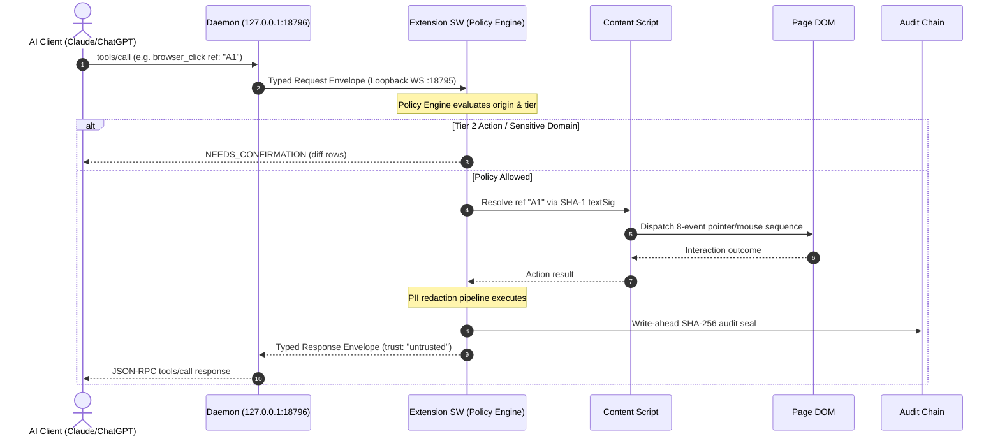

# Tether Architecture & Invariant Specifications

> **Normative reference:** `PRD.md §4`, `TRD.md §2-§8`, `AGENTS.md`.

---

## 1. Component Decomposition

Tether enforces modular separation across protocol, extension, daemon, relay, and evaluation packages.

```
tether/
├── packages/protocol/    # Wire types, envelopes, and frozen tool definitions (HR-4, HR-5)
├── apps/extension/       # Chrome Manifest V3 extension: policy engine, DOM refs, redaction
├── apps/daemon/          # Local loopback server, stdio/HTTP MCP, native OS keyring bridge
├── apps/relay/           # Cloudflare Workers + Durable Objects for remote E2E routing
├── packages/ocr/         # OS-native OCR redaction backend bindings
├── packages/eval/        # 50-task automated benchmark runner and scoring
└── apps/web/             # Static documentation and client pairing portal
```

### Module Responsibilities

| Subsystem | Modules | Core Responsibilities |
|---|---|---|
| **Protocol** | `envelope`, `errors`, `tools/*`, `policy`, `audit` | Defines all wire contracts, error codes, and 40 tool schemas. Zero dependencies. |
| **Extension** | `boot/`, `refs/`, `actions/`, `policy/`, `vault/`, `audit/` | **Single point of policy** (`TRD §2.3`); stable element ref resolution; DOM action synthesis; SHA-256 audit chaining. |
| **Daemon** | `ws/`, `mcp/`, `router/`, `vault/`, `ocr/`, `tray/` | Binds `127.0.0.1:18795` (WS) & `:18796` (HTTP); bridges OS keyring & native OCR; zero capability granting power. |
| **Relay** | `do/`, `routes/`, `crypto/`, `store/` | Durable Object device routing; blind ciphertext forwarding; D1 session storage. |
| **OCR** | `native/`, `redactor` | Local image scanning for PAN, emails, and tokens; bounding box blackout before return. |

---

## 2. Transport Matrix

Tether isolates communication patterns by operating environment:

| Mode | External Client Protocol | Internal Transport | Cryptographic Isolation |
|---|---|---|---|
| **Mode A (Local)** | stdio MCP or Streamable HTTP (`127.0.0.1:18796/mcp`) | Loopback WebSocket (`127.0.0.1:18795`) | Ephemeral session token; loopback origin verification |
| **Mode B (Relay)** | HTTPS / SSE Streamable HTTP | Outbound WSS tunnel to Durable Object | End-to-end `X25519` key exchange + `AES-256-GCM` envelope |
| **Mode C (WebMCP)**| Chrome 149+ model tools | Isolated content script bridge | Origin-namespaced tools: `site_<slug>__<tool>` |

---

## 3. Tool Call Execution Sequence



---

## 4. Cryptographic Key Inventory

| Key / Secret | Algorithm / Format | Storage Location | Lifetime & Rotation |
|---|---|---|---|
| **Session Keys** | X25519 (ECDH) + AES-256-GCM | Ephemeral memory only | Regenerated per browser session or reconnection |
| **Relay Auth Tokens** | Ed25519 signed JWT | Client storage / `chrome.storage.session` | 1-hour expiry with automatic kid rotation |
| **Vault Secrets** | AES-256-GCM encrypted blobs | Platform Keyring (DPAPI / Keychain / Secret Service) | Managed by OS credentials provider |
| **Audit Log Seals** | SHA-256 chained digests | `chrome.storage.local` audit store | Cumulative tamper-evident hash chain |

---

## 5. Manifest V3 Lifecycle & State Resilience

Chrome MV3 service workers are ephemeral and terminate after ~30 seconds of idle time (`HR-2`). Tether guarantees continuous availability via:

1. **State Rehydration:** Session tokens, grant rules, and pending step items persist in `chrome.storage.session` and rehydrate during `bootstrap()`.
2. **Wake on Connect:** Incoming native messaging and loopback WebSocket reconnections trigger immediate service worker activation.
3. **Idempotency Cache:** Requests carrying `idem` keys are cached for 10 minutes (`AC-P05-19`) to prevent duplicate executions across worker restarts.
4. **Alarm Keepalive:** A lightweight recurring alarm monitors transport liveness and triggers reconnect backoff when the local daemon restarts.

---

## 6. Verification & Test Pyramid

Quality gates are validated continuously through layered test suites:

| Test Layer | Test Count | Scope & Technologies | Verification Command |
|---|---|---|---|
| **Unit Tests** | 438 passed | Pure protocol schemas, policy engine matching, redaction regexes, and ref trees | `pnpm test` |
| **E2E Integration** | 13 scenarios | Real Chrome MV3 + real daemon; DOM actions, OCR redaction, kill switch latency | `pnpm test:e2e` |
| **Live Evaluation** | 50 tasks | Automated 50-task suite testing navigation, extraction, forms, and refusal policy | `pnpm eval` |
| **Security Greps** | 8 checkers | Zero forbidden APIs (`eval`, `new Function`), strict MV3 permissions, and schema checks | `pnpm run check` |

---

## 7. Hard Invariants Index (HR-1 .. HR-14)

All fourteen governing rules from `PRD.md §4` are enforced by dedicated runtime guards:

| Invariant | Specification | Enforcing Module | Verification Test |
|---|---|---|---|
| **HR-1** | No remote code execution | `scripts/check-forbidden-apis.mjs` | `pnpm run check` |
| **HR-2** | Strict Manifest V3 only | `apps/extension/wxt.config.ts` | `check-manifest-permissions.mjs` |
| **HR-3** | Least privilege permissions | `PERMISSIONS.md`, extension manifest | `check-manifest-permissions.mjs` |
| **HR-4** | Single protocol definition | `packages/protocol` | `packages/protocol/test/version.spec.ts` |
| **HR-5** | Additive-only tool schemas | `packages/protocol/src/tools/index.ts` | `packages/protocol/test/tools.spec.ts` |
| **HR-6** | Page content tagged untrusted | `apps/extension/lib/session/orchestrator.ts` | `apps/extension/test/session/orchestrator.spec.ts` |
| **HR-7** | Zero secrets in model context | `apps/extension/lib/vault`, `redact` | `apps/extension/test/vault/vault.spec.ts` |
| **HR-8** | Informed confirmation on Tier 2 | `apps/extension/lib/policy/engine.ts` | `tests/e2e/scenarios-policy.spec.ts` |
| **HR-9** | Tool resolution $\le 30$ seconds | `apps/extension/lib/session/orchestrator.ts` | `packages/protocol/test/tools.spec.ts` |
| **HR-10**| Absolute kill switch $\le 200$ms | `apps/daemon/src/server/ws.ts`, `keepalive.ts` | `tests/e2e/scenarios-kill.spec.ts` |
| **HR-11**| Structured error returns | `packages/protocol/src/errors.ts` | `apps/extension/test/background.spec.ts` |
| **HR-12**| Default deny sensitive categories | `apps/extension/lib/policy/engine.ts` | `apps/extension/test/policy/categories.spec.ts` |
| **HR-13**| Zero telemetry in Mode A | `apps/daemon/src/index.ts` | `scripts/check-network-egress.mjs` |
| **HR-14**| In-product notices for changes | `apps/extension/entrypoints/sidepanel` | `apps/extension/test/policy/engine-steps.spec.ts` |
